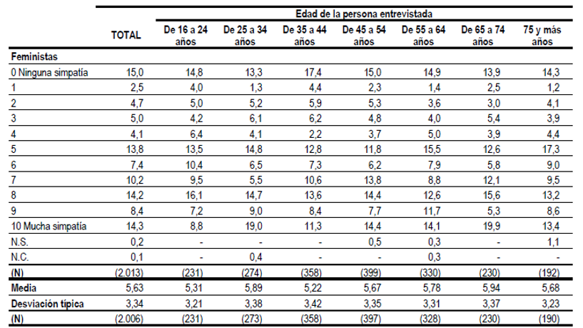
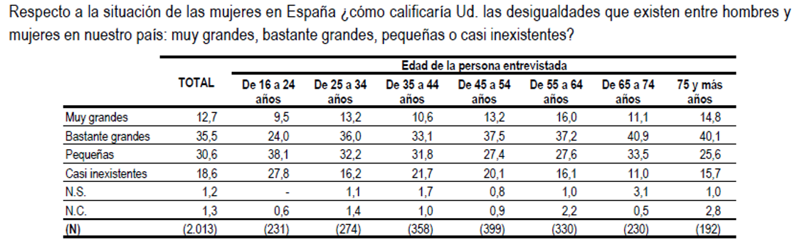
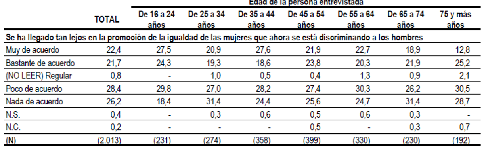

# Charla Hombres pro feministas - 23-3-2026 Cruz Roja

## Indice

1. Presentación personal

2. 'No todo esta perdido' : estadísticas de precepción del feminismo en hombres jóvenes vs maduros 

3. (broma) que cosa pueda ser un hombre pro feminista : video 'el hombre performativo'

4. Un hombre pro feminista : mi visión personal => Juego de puntos

5. Enfoque académico 

6. Grupos de hombre pro-feministas, panorámica
   
   ---
   
   ## 

## 1. Presentación Personal

62 años , casado , 1 hija de 15 años 

Desde 2004 en el grupo de hombres pro- feministas STOPMACHISMO - hasta la actualidad

Participacion activa en la PPIINA como miembro de Stopmachismo 2007 - 2014

## 2. "No todo esta perdido"

Hay últimamente un lamento que recorre los foros feministas y las conversaciones 'progres' sobre **lo machistas que se han vuelto los hombres jóvenes:** **Desgraciadamente es completamente cierto**

Fig 1 : simpatía o antipatía respecto al feminismo - grupo hombres según edad

Fig 2 : Percepción de la desigualdad entre H y M - grupo hombres según edad

Fig 3 : De acuerdo con "Se ha llegado tan lejos en la igualdad que ahora se discrimina a los hombres" - grupo hombres según edad

Son solo algunos ejemplos obtenidos de : CIS PERCEPCIONES SOBRE LA IGUALDAD ENTRE HOMBRES Y MUJERES Y ESTEREOTIPOS DE GÉNERO. Muestra hombres Estudio nº 3428_1 Noviembre 2023

[Estudio nº 3428_1 Noviembre 2023](./doc/Es3428sd_Hombres_A.pdf)

Estudios internaciones muestran el mismo patrón (con las lógicas diferencias por países) : [IWD charts 2025](./doc/IWD 2025 Global Charts FINAL_1.pdf)

Por un lado, esta visión es algo , o muy , **edadista** porque implica que los hombres mayores ya no pintamos nada. Seguimos luchando, mucho o poco , pero seguimos luchando.

Por otro lado, se puede interpretar que **al ir creciendo en edad y conocimiento, los hombres nos volvemos menos machistas**

En resumen, no todo esta perdido

## 3. (broma) que cosa pueda ser un hombre pro feminista : video 'el hombre performativo'

[HOMBRE PERFORMATIVO - YouTube](https://youtu.be/OqxtWm20hoI?si=quTcrhhRBFQ1K6Eg)[HOMBRE PERFORMATIVO - YouTube](https://youtu.be/OqxtWm20hoI?si=quTcrhhRBFQ1K6Eg)

## 4. Un hombre pro feminista : mi visión personal => Juego de puntos

### “Árbol de decisión ético – Feminista”  para hombres, comprueba tu puntuación: máximo 10

**<u>G1 - Puntos +2</u>**

***Creo en la premisa ética y legal básica del feminismo, de que cada hombre o mujer debe tener los mismos derechos y obligaciones individuales***

**<u>G2 Puntos +3 </u>( si se ha contestado SI a G1)**
Creo que, **si los derechos individuales iguales entre hombres y mujeres se pudieran ejercer de forma efectiva, colectivamente hombres y mujeres estarían representados en un 50-50**aproximadamente en:
    • Organismos de Re prestación política
    • Puestos relevantes en la economía como empresas o instituciones financieras
    • Cargos relevantes en todas las profesiones incluidas las de más prestigio
    • Porcentajes de estudiantes en carreras de ciencias o ingeniería ..

O **dicho de forma negativa, que el género no debería explicar estadísticamente** las diferencias en:
    • Ganancias económicas medias
    • El tiempo empleado en trabajos no remunerados de cuidado …

**<u>G3 Puntos +2</u>** **( si se ha contestado SI a G2) se pueden obtener 0,5 puntos, ….**
**Trabajas tu modelo de comportamiento masculino**o para deconstruirte de la educación / socialización recibida y haces cambios en tu comportamiento/ acción  frente a tu pareja/ mujeres en general desde las mas cercanas a las lejanas
Ejemplo: participas en un grupo de hombres que reflexionan sobre su comportamiento | Escuchas a tu pareja/amigas mujer/es sobre tus (pequeños?) comportamientos machistas 

**<u>G4 Puntos +1</u> ( si se ha contestado SI a G2), se pueden obtener 0,5 puntos o 0,25 o ..**
¿Conoces y apoyas las reivindicaciones del movimiento feminista (estándar) en España actualmente?
Ejemplo: vas a la manifestación del 8 m o la del 25 M

**<u>G5 Puntos +1 </u>( si se ha contestado SI a G2) se puede obtener 0,5 puntos, …**
¿En **qué reivindicaciones del movimiento feminista participas**más activamente siendo hombre?
Ejemplo: ¿criticas delante de otros hombres los chistes machistas, o comentarios despectivos y culpabilizadores a las mujeres que denuncian acoso?

**…. ya sabemos que el máximo no es 10, seguramente en otra reencarnación   😉😅🤣**

## 5. Enfoque académico

España destaca por una base teórica sólida en estudios de masculinidades:

* Luis Bonino, acuñó el termino micro-machismos : ["Los Micromachismos
  Luis Bonino © 2004"](./doc/Los_Micromachismos_2004_Luis_Bonino.pdf)

* Iván Sambade

* Observatorio de Masculinidades UMH

* ...

Son los algunos ejemplos 

## 6. Grupos de hombre pro-feministas, panorámica

- Dos enfoques de acción : Introspección / Apoyo agenda feminista ( + en cuidados)

- Dos motivaciones : El machismo es toxico para los hombres / Justicialistas

- Redes de grupos / iniciativas globales
  
  - [ONU HeForShe](https://www.heforshe.org/es)
  
  - [MenEngage Iberia](https://menengageiberia.org/)
  
  - [Red Hombres por la Igualdad](https://redhombresigualdad.org/)
  
  - [AHIGE – Asociación de Hombres por la Igualdad de Género](https://ahige.org/)
  
  - [STOPMACHISMO](https://www.stopmachismo.net/)

- Mapa de grupos actualmente en Madrid
  
  [Red de grupos de hombres de Madrid contra el machismo](https://redgruposhombresmadrid.wordpress.com/)

  

  ---

  FIN

  ---
